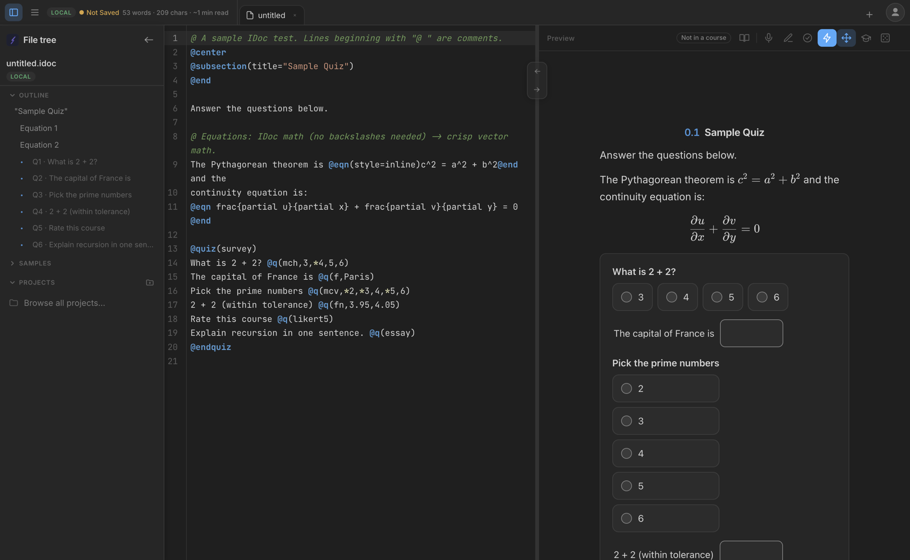
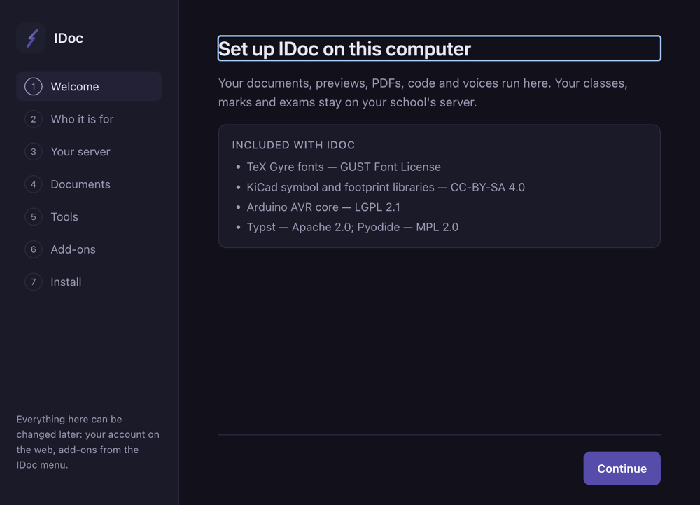
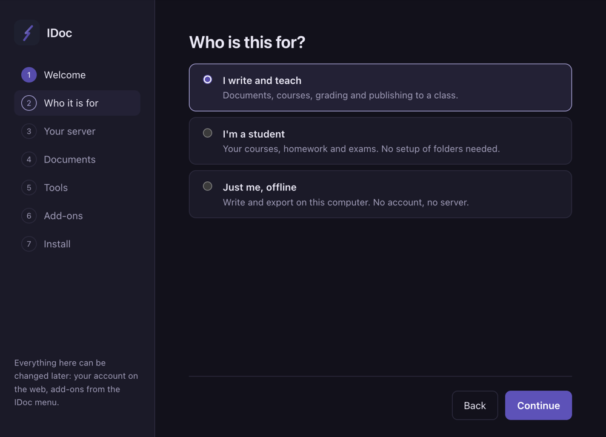
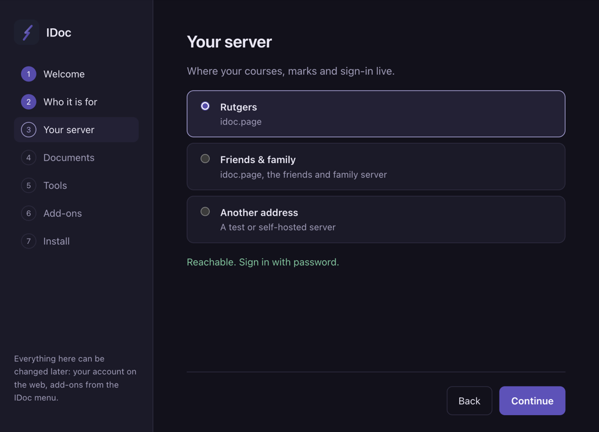
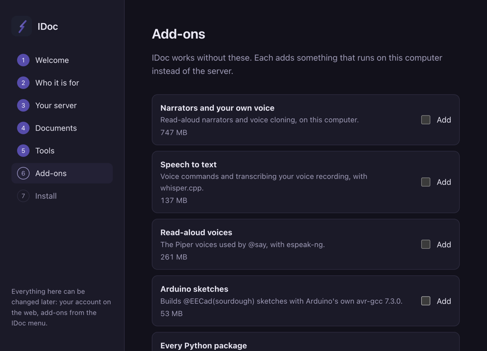

<div align="center">


# IDoc

**One file holds the whole lesson — and an app that runs all of it on your own computer.**

Prose, mathematics, slide decks, circuits, runnable code and autograded
questions, written in plain text and rendered live as you type.

[](../../releases/latest)
[](../../releases/latest)
[](../../releases/latest)
[](../../releases/latest)

[Download](#download) · [What it does offline](#what-the-app-does-that-a-browser-cannot) · [First run](#first-run) · [Add-ons](#add-ons) · [Updates](#updates)

</div>

<br>



<div align="center"><sub>The source on the left, the paper on the right, both live. Same document, same answers, same marking as the web.</sub></div>

<br>

This is where the **installed app** is published: the downloads, the add-on
packs, and the feed the app checks for updates.

---

## Download

Take the newest build from **[Releases](../../releases/latest)**.

| Your computer | The file to take | About |
|---|---|---|
| **macOS**, Apple silicon | `IDoc-<version>-arm64.dmg` | ~363 MB · drag to Applications |
| **Windows** 10 / 11, 64-bit | `IDoc-Setup-<version>.exe` | ~309 MB · installs for you alone, no administrator needed |
| **Linux**, 64-bit | `IDoc-<version>-x86_64.AppImage` | ~353 MB · one file, no install — [see below](#opening-it-on-linux) |

> [!IMPORTANT]
> **These builds are not signed yet.** macOS will say the app is from an
> unidentified developer — open it once with right-click → **Open**. Windows
> SmartScreen will warn — **More info** → **Run anyway**. Signing identities are
> being arranged; until they exist, this notice is the honest state of it.

### Opening it on Linux

An AppImage is the whole app in one file: nothing to install, nothing to
uninstall — keep it wherever you like and delete it when you are done. Two
steps, and a third only if your machine needs it.

**1. Let it run.** A downloaded file is not executable. In Files, right-click →
**Properties** → **Permissions** → tick **Allow executing file as program**; or
in a terminal:

```bash
chmod +x IDoc-0.1.1-x86_64.AppImage
```

Skip this step and the only thing you get is `Permission denied`.

**2. Open it.** Double-click it, or run `./IDoc-0.1.1-x86_64.AppImage`.

**3. Only if it refuses, naming `fusermount`:**

```
fuse: failed to exec fusermount: No such file or directory
open dir error: No such file or directory
```

Nothing is wrong with the app or the download. An AppImage mounts itself using
FUSE, and many machines no longer ship it. Either run it without mounting —

```bash
./IDoc-0.1.1-x86_64.AppImage --appimage-extract-and-run
```

— or install FUSE once, after which double-clicking works: `sudo apt install
fuse` on Debian, `libfuse2` on Ubuntu 22.04, `libfuse2t64` on Ubuntu 24.04,
`sudo dnf install fuse` on Fedora.

A good place to keep the file is `~/Applications`, so an update is one file
replaced.

---

## What the app does that a browser cannot

**Everything works offline.**
The editor, PDF typesetting, Python, C and C++, the circuit simulator,
read-aloud and voice commands all run on your own machine. Nothing is sent
anywhere to make a document work.

**Your work is yours.**
Documents are files in a folder you choose. Answers typed into a paper survive
a crash or a lost connection, and are handed in when the connection returns.

**Locked exams that are not spyware.**
A course can set a paper that is taken only in the app's locked window. It
takes no pictures and watches no screens. It puts the paper in a window you
cannot leave without the attempt recording that you did — and it says exactly
that on screen before you start.

**The course still comes from the server.**
Signing in, the class list, marks and hand-ins are the same as on the web. The
app signs in through your own browser, never a window of its own, and you can
sign a computer out again from your profile at any time.

---

## First run

One screen, seven short steps, and every answer can be changed later.

<table>
<tr>
<td width="50%"></td>
<td width="50%"></td>
</tr>
<tr>
<td><sub><b>Welcome.</b> What ships inside, and under which licence.</sub></td>
<td><sub><b>Who it is for.</b> A student is never asked to lay out folders.</sub></td>
</tr>
<tr>
<td></td>
<td></td>
</tr>
<tr>
<td><sub><b>Your server.</b> Checked for real, before you continue.</sub></td>
<td><sub><b>Add-ons.</b> Tick what you need; skip them all and IDoc still works.</sub></td>
</tr>
</table>

IT staff can skip the window entirely: `IDoc --setup-apply choices.json` applies
the same answers headlessly and exits non-zero, with a reason, if any of them
is wrong.

---

## Add-ons

The app installs small and offers the heavy parts when you need them. Open the
**IDoc menu → Add-ons**, or tick them during setup. Each is downloaded from this
repository, checked against a fingerprint, and refused outright if it does not
match — a pack that fails the check writes nothing.

| Add-on | What it gives you | macOS | Windows | Linux |
|---|---|:--:|:--:|:--:|
| **Read-aloud voices** | The Piper voices behind `@say`, with espeak-ng | 747 MB | 747 MB | 747 MB |
| **Every Python package** | The full library set for `@code(python)` | 384 MB | 384 MB | 384 MB |
| **Narrators and your own voice** | Read-aloud and voice cloning on this computer | 261 MB | — | 134 MB |
| **Speech to text** | Voice commands and transcription, with whisper.cpp | 137 MB | 134 MB | 138 MB |
| **C and C++** | A toolchain for `@code(c)` without one installed | — | 74 MB | 74 MB |
| **Arduino sketches** | Builds `@EECad(sourdough)` sketches with avr-gcc 7.3.0 | 53 MB | 50 MB | 53 MB |

Removing one takes it off the computer again; nothing is left behind.

<details>
<summary><b>Where the packs actually live</b></summary>

<br>

The archives are published on their own tag, **[`packs-v1`](../../releases/tag/packs-v1)**,
so an app release lists the three things a person downloads rather than fifteen
things a machine does. That tag is marked a pre-release on purpose: GitHub's
"latest" is the newest release that is *not* one, and the app finds its update
feed through `releases/latest`.

`manifest.json` on the app's own release is the list the app reads, and it names
every archive by absolute URL — which is what let the packs move house without
any already-installed copy of the app noticing.

</details>

---

## Updates

`latest.json` on the newest release is what the app reads to notice a new
version. It tells you, with the note for that version, and waits. **Nothing is
ever installed behind your back**, and an update never touches your documents or
the add-ons you have already installed.

---

## Reporting a problem

[Open an issue](../../issues/new). Please say what you were doing, which build
you have (**IDoc menu → About**), and what happened instead. A document that
shows the problem helps more than anything else.

<div align="center">
<br>
<sub>IDoc is part of <b>Knowsy</b>, built at Rutgers.<br>
Copyright © 2026. All rights reserved. The app is distributed here as a
binary; no licence to its code is granted.<br>
Bundled with the app: TeX Gyre fonts (GUST Font License) · KiCad symbol and
footprint libraries (CC-BY-SA 4.0) · Arduino AVR core (LGPL 2.1) ·
Typst (Apache 2.0) · Pyodide (MPL 2.0).</sub>
</div>
